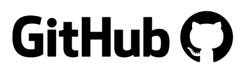

# Hola, mi nombre es Sebastian Habib 👋
### Freelance Python and Data Science

Soy estudiante  de  Python y Data Science

En 2022 comenzé en el mundo de la programacíon y Data Science. 
Profesional en formación haciendo sus primeros pasos.
Mi intención es colaborar con las empresas y personas de todas partes del mundo.
Aqui encontraran las cosas que fui aprendiendo y los proyectos con los que trabajo y continuamente me capacito.

## Tecnologías actuales:

## Links:

 

# Mis proyectos en la comunidad

## Git & GitHub

#### Puedes apoyar mi trabajo haciendo "☆ Star" en el repo o nominarme a "GitHub Star". ¡Gracias!

## Contacto y apoyo:

[_Gracias!-orange?style=for-the-badge&logo=Microsoft+Outlook&logoColor=white&labelColor=101010)](https://mypublicinbox.com/turquisss87)
 

 
